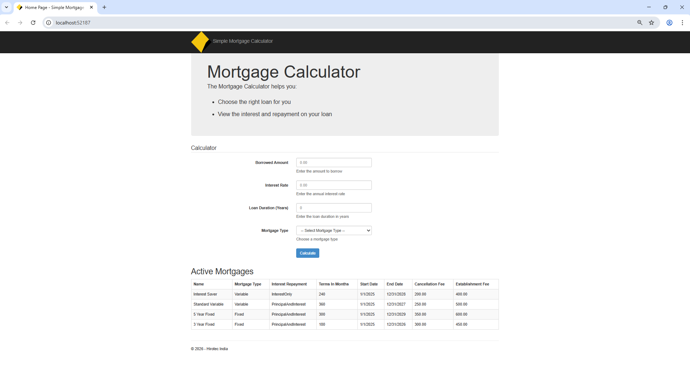
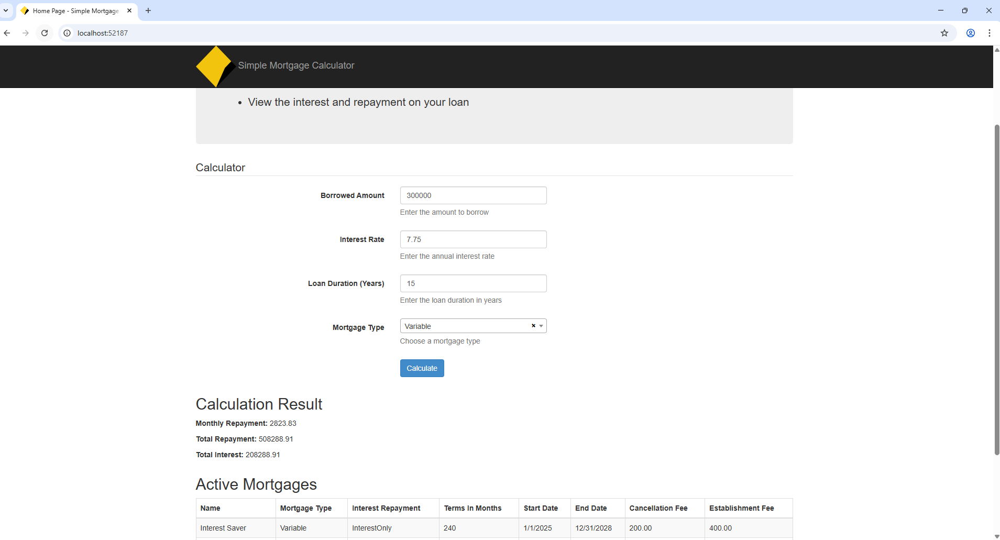
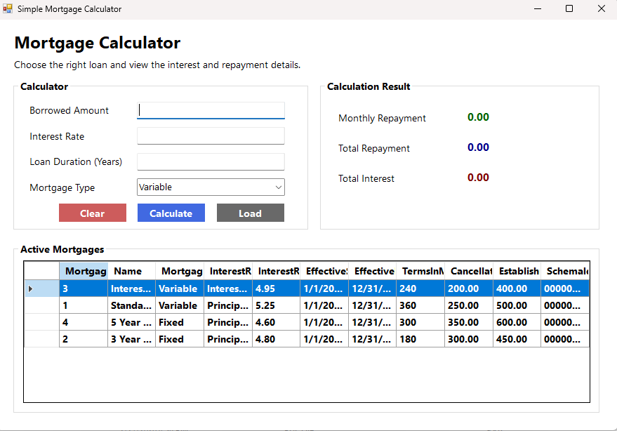

# Mortgage Calculator

 

A **Mortgage Calculator application** developed as part of a technical
machine test.

The original repository contained **unfinished code and compilation
issues**.\
This solution focuses on **troubleshooting the existing project, fixing
architectural problems, and completing the application**.

The completed project supports **both Web and Windows desktop
platforms** and follows a **clean N-Layer Architecture** for
maintainability and scalability.

------------------------------------------------------------------------

# Application Preview

### Web Application

### Windows Forms Application

------------------------------------------------------------------------

#  System Architecture

The solution is designed using **N-Layer Architecture** to separate
responsibilities across layers.

    Presentation Layer
    │
    ├── MortgageCalculator.Web
    │       ASP.NET MVC Web Application
    │
    ├── MortgageCalculator.WinFormsUI
    │       Windows Desktop Application
    │
    Business Layer
    │
    ├── MortgageCalculator.Services
    │       Business logic and mortgage calculation
    │
    Data Access Layer
    │
    ├── MortgageCalculator.Data
    │       Entity models
    │       DbContext
    │       Repository pattern
    │
    Shared Layer
    │
    ├── MortgageCalculator.Dto
    │       Data transfer objects
    │
    Testing Layer
    │
    └── MortgageCalculator.UnitTests
            NUnit test project

------------------------------------------------------------------------
# Key Improvements and Fixes

1. Updated the project to .NET Framework 4.8.

2. Refactored the solution into proper N-Layer architecture by creating separate projects for:
   - Repository layer
   - Service layer

3. Moved repository and service classes from the Web project into dedicated projects.

4. Corrected compilation errors and dependency issues across the solution.
      - Fixed incorrect fee mapping in the repository.  
          `EstablishmentFee` was incorrectly assigned using `CancellationFee`.  
          Corrected to map `EstablishmentFee` properly.
    
    - Fixed incorrect enum parsing logic.  
          `InterestRepayment` was incorrectly parsed using `MortgageType`.  
          Corrected to parse using the `InterestRepayment` field.
    
    - Enabled missing loan term mapping.  
          `TermsInMonths` property was commented out in the repository mapping.  
          Re-enabled to ensure the UI receives the mortgage duration.

6. Implemented the missing `MortgageDataContext` class using Entity Framework 6.5.

7. Created entity models for database interaction.
8. Modified the **Index page** in the MVC application to load **active mortgage data** from the service layer.
9. Implemented the **mortgage calculation functionality** in the MVC project to calculate:
      - Total repayment over the lifetime of the loan
      - Total interest paid over the lifetime of the loan
10. Connected the UI inputs (**Loan Amount, Interest Rate, Loan Duration**) with the service layer to perform the calculation.
    
11. Created a **Windows Forms UI** implementing the same functionality as the MVC application, including:
      - Displaying active mortgage data
      - Mortgage type autocomplete dropdown
      - Mortgage calculation inputs and results
      - Clear functionality to reset the calculator fields
12. Added a **Unit Test project (NUnit)** to validate key service layer functionality including:
      - Mortgage calculation logic
      - Active mortgage filtering
      - Sorting by mortgage type and interest rate
      - Validation scenarios for invalid inputs

------------------------------------------------------------------------
#  Features

## Mortgage Listing

Retrieve **active mortgages** based on:

-   Effective Start Date
-   Effective End Date

------------------------------------------------------------------------

## Sorting Support

Mortgage records can be sorted by:

-   Mortgage Type
-   Interest Rate

------------------------------------------------------------------------

## Mortgage Type Autocomplete

The Web UI supports **smart autocomplete** using:

-   **jQuery**
-   **Select2**

------------------------------------------------------------------------

## Mortgage Calculator

Users can enter:

-   Loan Amount
-   Interest Rate
-   Loan Duration (Years)

The system calculates:

-   Monthly repayment
-   Total repayment
-   Total interest paid

------------------------------------------------------------------------

## Windows Desktop UI

The Windows Forms application includes:

-   Mortgage list display
-   Mortgage type dropdown
-   Loan calculation fields
-   Clear/reset functionality

------------------------------------------------------------------------

## Unit Testing

Implemented using **NUnit**.

Test scenarios include:

-   Mortgage calculation accuracy
-   Zero interest scenarios
-   Invalid input validation
-   Active mortgage filtering
-   Sorting behavior

------------------------------------------------------------------------

# Technology Stack

 | Technology           | Purpose                |
| -------------------- | ---------------------- |
| .NET Framework 4.8   | Application Framework  |
| Entity Framework 6.5 | Data access ORM        |
| ASP.NET MVC          | Web UI                 |
| Windows Forms        | Desktop UI             |
| jQuery               | Client scripting       |
| Select2              | Autocomplete dropdown  |
| NUnit                | Unit testing framework |

------------------------------------------------------------------------

#  Database Setup

The application uses **SQL Server LocalDB**.

Connection string configuration is located in:

-   `Web.config`
-   `App.config`

Example:

    Data Source=(localdb)\MSSQLLocalDB
    Initial Catalog=MortgageCalculatorDb
    Integrated Security=True

------------------------------------------------------------------------

#  How to Run the Project

### 1. Restore NuGet Packages

    NuGet Restore

### 2. Setup Database

Create the database or run the provided SQL scripts.

### 3. Update Connection String

Modify connection string if required.

### 4. Run Application

Run either:

-   `MortgageCalculator.Web`
-   `MortgageCalculator.WinFormsUI`

------------------------------------------------------------------------

#  Project Structure

    MortgageCalculator
    │
    ├── MortgageCalculator.Dto
    ├── MortgageCalculator.Data
    ├── MortgageCalculator.Services
    ├── MortgageCalculator.Web
    ├── MortgageCalculator.WinFormsUI
    └── MortgageCalculator.UnitTests

------------------------------------------------------------------------

#  Author

Machine Test Submission By Arivazhagan

------------------------------------------------------------------------

#  Future Improvements

Possible enhancements:

-   REST API for mortgage services
-   ASP.NET Core migration
-   Docker containerization
-   CI/CD pipeline
